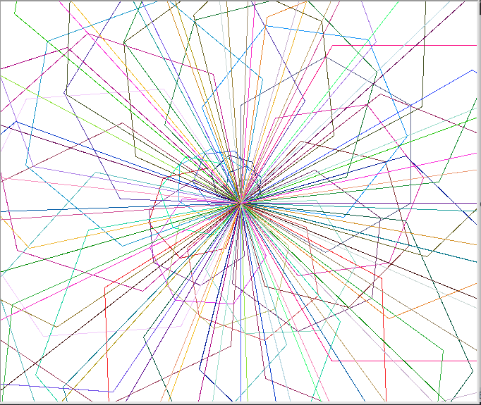
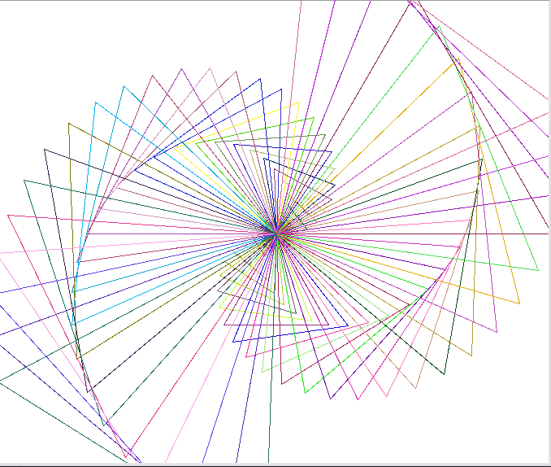

# RandomDraw

## About

RandomDraw is a Hexbot submission that uses colors to generate parameters for drawing a semi-random pattern.

The relatively simple python program utilizes turtle graphics to illustrate a range of different designs that vary depending upon its input from Hexbot.

## Screenshots

