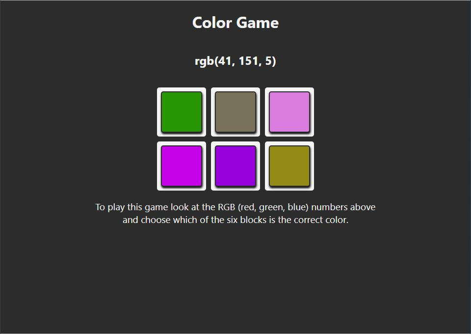

# RGB Game
#### Instuctions
To play the game you will be given an RGB number at the top of the page, you will click on one of the six colors on the page that corresponds (instructions are also given on the webpage). 

### Game Preview

## Available Scripts

In the project directory, you can run:

### `npm start`

Runs the app in the development mode. 
Open [http://localhost:3000](http://localhost:3000) to view it in the browser.
