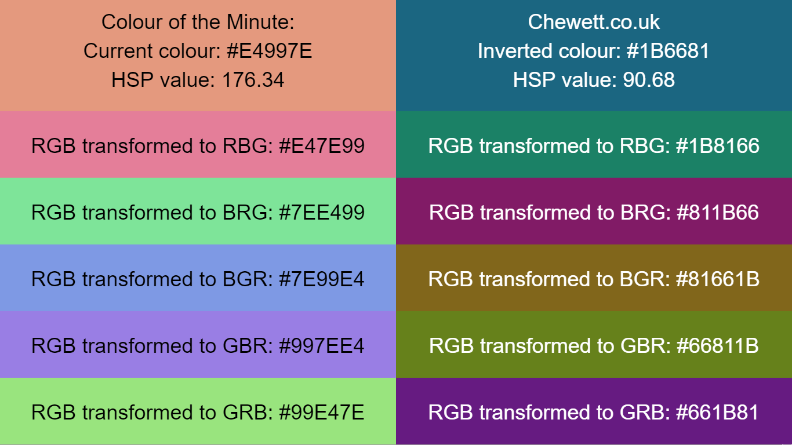

Chewett's Colour Transitions
----------------------------

Full code is available in [my repo](https://github.com/chewett/hexbot).

A live example is available online on
 [chewett.co.uk/noops/](https://chewett.co.uk/noops/hexbot/).
I also talk about this more on
 [my blog](https://chewett.co.uk/blog/2344/my-github-noops-hexbot/).

Every 15 seconds a new colour is requested. Once requested the
page will transition to the new colour. 

There are twelve colour panels displayed on the page. On
the left is the colour given by the API and 5 transformed
colours, RBG, BRG, BGR, GBR, and GRB.

On the right hand side there are the same 6 colour permutations,
with the inverted colour given by the API.

Inversion of the colour is performed by converting the hex
code into individual R, G, B components and removing their
value from 255 to get the new value.

The colour of the text is decided by calculating
the HSP value for each of the codes. If the value is less
than (255/2) then the text will be white. If it is higher
than this value the text colour will be black. This ensures
that the text colour is chosen to contrast nicely with the colour.

HSP is calculated as documented 
[by Darel Rex Finley](http://alienryderflex.com/hsp.html).