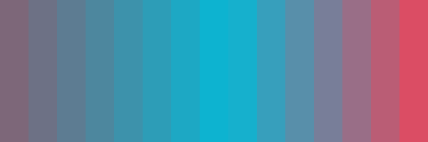

# 👀 **About**

Gradient Generator is a simple Python 3 application that uses Hexbot to get random colors from and then turn them into a gradient.
The application supports two types of gradients: Smooth and Striped.

# 📸 **Screenshots**

### Colors generated by hexbot:

### Smooth gradient generated

### Colors generated by hexbot:

### Striped gradinet generated

## Using 5 colors

