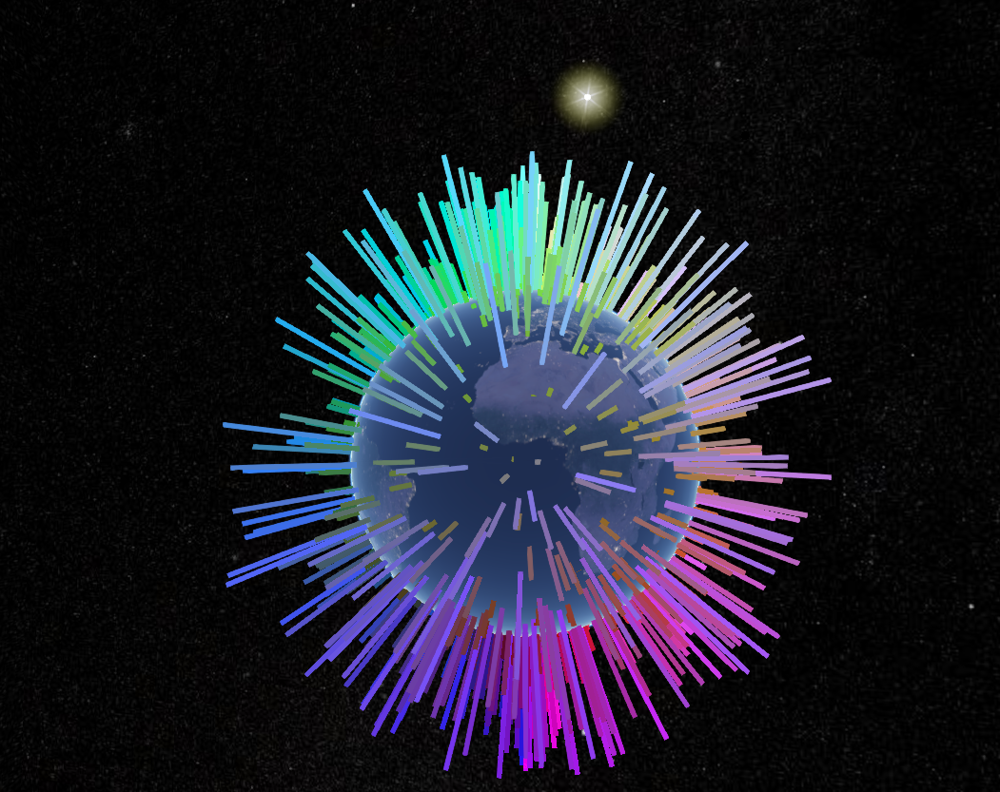
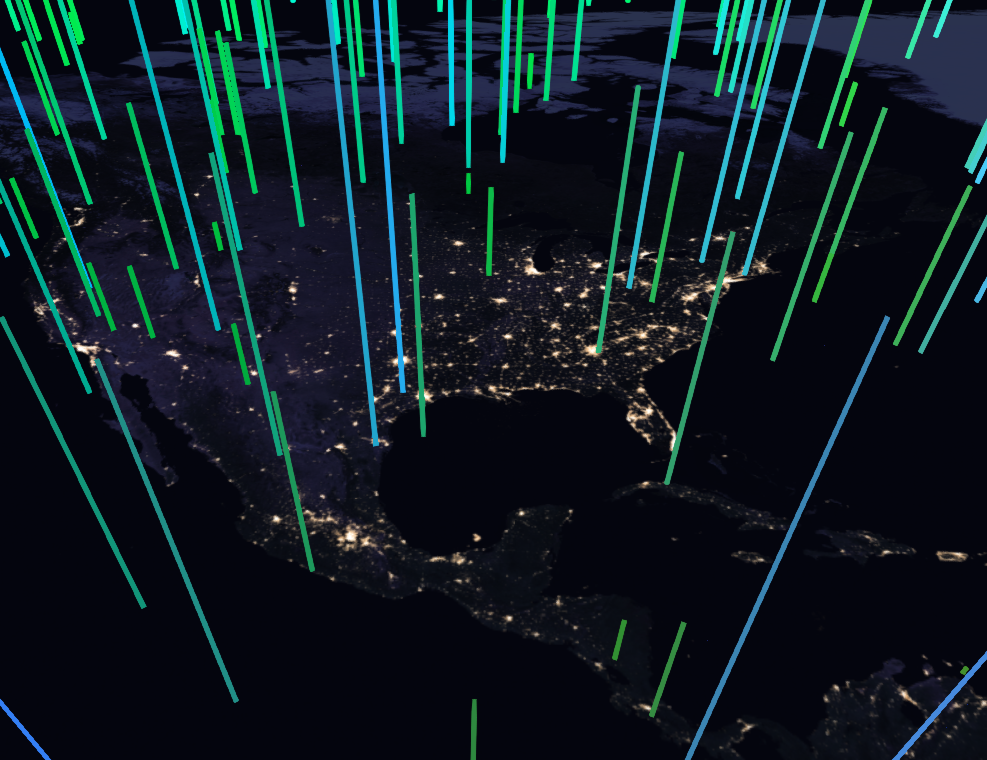

# HexBot submission

My HexBot implementation interpolates a RGB value to a longitude (RED), latitude (GREEN), and altitude (BLUE) coordinate and plots the results on a 3D globe using [Cesium JS](https://cesiumjs.org/index.html).

-   view a live demo [here](https://lonnygomes.github.io/hexbot-demo/) to experiment with the 3D color globe
-   view the source [here](https://github.com/LonnyGomes/hexbot)

## Screenshots

### 3D Globe Perspective

### 2.5D Globe Perspective

See the [README](https://github.com/LonnyGomes/hexbot#-meet-my-hexbot) for more information on how the colors are plotted and calculated.
